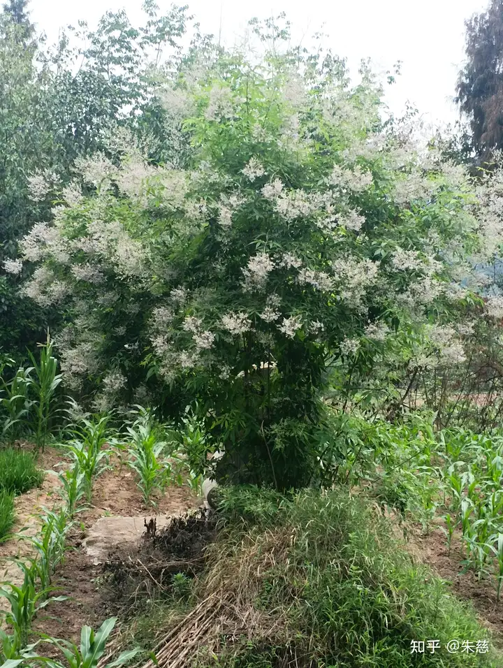

# 我生病在家好久了，可以拍照给我看看外面的风景嘛?

不出意外的话，我应该是唯一一个分享坟照的人。

虽然它真的是座很美的坟。

我知道这是个满是关怀的问题，也并无充当气氛破坏者的恶趣味，因为发出这张照片代表了在我眼里它真的很美。

拍到这座坟的时候是今年六月份，你大概还能记得那时天气还不像现在这样冻手呢，在四川的大山里六月总是有点微润的干燥，周遭的旱田里都是比葱高的包谷苗。

一吹起风来，哗啦啦晃一片。

当时我在准备着去成都住院，应家里人的强行要求，不过和你不一样的是，我是个精神病患。

所以得去那种墙很高很高的地方。

因为得把我关好，以免我跑到大街上咬别人家的车屁股，众所周知我是个臀控。这听上去有点像是玩笑，但作为非正常人类理应有这样的幽默。

而遇见这座坟其实是机缘巧合，因为平常我散步并不会绕到这座山上来，在长时间的独居生活里，我一般的溜达轨迹是绕着门口的那片大湖转圈，很少会去山上。

可是那段时间我老是觉得自己要死了，于是就想上山看看，简单来说就是参考下前人经验，准备提前构思一下自己的坟墓，是做个椭圆形的碑，还是做个三角形的碑。

你看到这里可能会觉得疑惑，明明我只是精神病，说不定我的身体壮的像头牛，天天咩来咩去吃点嫩草就能够扛着红薯到处乱跑。

我为什么会觉得自己要死了呢。

但事实就是这样，因为我老是听到奇怪的声音，看到奇怪的东西，和残疾者的踉踉跄跄有些相似的是，我的脑子仿佛也不受自己的控制。

每当天黑下来，这个平日里用以思考的玩意儿就会像被灌入了凝固胶水一样，变得粘稠且呆滞。

很准时的，就像我的躯壳里长了个闹钟。

我会躺在床上，在漆黑一片的屋子里感受着呼吸，会有很多令人难以面对的事开始从脑海里涌出，而我的四肢也疲惫地蜷缩着。

那呼吸会越来越衰微，心跳声也变得沉重了许多，然后就是耳边嘈杂的谩骂，以及墙角处我都看腻了的死人。

当然，那是虚假的。

一切直到慢慢在不适感里睡着，最后再从噩梦里醒过来。

这样的生活，我过了好多年。

而我那阴暗的童年以及肮脏混乱的人生不必向你提及，倘若你知道知道芋虫的话，大概就可以想象出我的状态，伴随着时间的推移，我所能够感知到的一切事物也越来越微弱，我慢慢变得迟钝且呆滞，像没有四肢，也没有眼睛和耳朵的蠕虫那样蜷缩在底下的菜叶上。

所以某一刻我觉得我大概真的快死了，但偏偏我又蛮怕死的，是真的怕死，毕竟我实在沉不下心逼自己做个有神论者，寄希望于菩萨哪天来下凡把我带走。

我开始到处走走，试图消散那种恐惧。

而在纷乱的情绪下，我就这样和这座开了花的坟撞见了，坦白讲着实有点猝不及防。

我起初还以为自己眼花了，认为那只是个不起眼的小土包，直到我从侧边窥见到了那块农村到处都是的石碑，我才意识到这是一座坟。

这简直太奇怪了真的。

要不是拍下来了，我还以为自己又出现了幻觉。

这样一座开花的坟出现在这里，总有一种我满脸的麻子里忽然冒出个美人痣的意味，因为它太突兀了，和这片土地上刻在骨子里的压抑根本不兼容。

换句话说，它简直浪漫的有点过头了。

我叼着烟蹲在路边上，绞尽脑汁地审视着这座开花的坟，试图在我的认知里给它找出一个合理的解释，比如风水，比如巧合，比如乱七八糟的各种理由。

但最后我还是放弃了，因为无论是哪种理由，它都像我一样不太正常。

只不过我是不正常的人，它是不正常的坟。

不远处被拴在树上的羊还在慢条斯理地嚼着地上的野草，风吹着那坟头上的枝条把零碎的白色摇摇晃晃。

周遭太安静了，然后我在路边撒了泡尿。

可忽然间我就觉得对于死亡的恐惧被消散了一些，这肯定不源于墓主人没有爬出来和我进行公德比赛，而是这座坟以极其别扭的形象告诉了我，似乎死亡也没有什么大不了的。

它似乎无法阻止人类以另一种方式延续着传递，即便我知道里面的人早已死了，或许那尸骨都已腐化成灰烬。

毕竟如何鉴定一座坟的年龄，那需要找到坟的父亲。

但在生命结束之后，关于死者的痕迹却依旧在某一刻被生者所注视。

而被注视的，则一定存在着。

所以在我那过于充盈的想象力里，我几乎都要和这位陌生的死者勾肩搭背，并递给他一杆草烟，称赞他的创意是如此的唯美。

当然，他什么也不会知道，因为他已成空白。

可这就是很有趣，在我痛苦了很多年以后，我终于意识到生命也许没有那么多的意义，它可能仅仅只是为了这些有趣的事物与体验才存在着。

去感受那些突兀的，不明所以的事物模样。

然后把全部的痛苦都以我的有趣留给死亡。

我不会在死去以后得知他人的目光，那没关系了，因为生命的结束就是你我视线的缓慢退场。

于是我好像找到了自己的定位，是一位在默剧里表演的哑巴，我以夸张的动作和神态，试图在痛苦的上面盖上一层伪装。

我回忆起偶尔出现的那些幻听，许多陌生的声音会告诉我，这样痛苦，麻木，肮脏的生命，连同藏匿它们的那具臭皮囊一样没有意义。

但我现在愿意喉咙嘶哑，然后把我那野草般被咀嚼的生命，描绘成开着大朵大朵花的坟，以及一个有趣但我再也看不见的突兀形象，并以此来等待下一个人。

他不必追寻我的痛苦和不堪，不必知晓我那吊诡的荒诞人生，只在我死去很多年以后，偶然路过我那已经长大的坟，然后在山中发出一声嗤笑。

好像也不错，还同时兼具安全感与神经质。

毕竟生命的奔腾到最后都是力竭的野马。

所以满地的精神病患都在开花，但唯独我是大艺术家。

一切都会结束，但你的世界还在延续。

去以有趣的生命在这片土地上留存，从这里开始，当你知道遥远的大山里竟然还有这么有趣的坟，那说明留给你的时间还足够的充裕。

这个问题下的讨论本已经很完美了，但奈何作为连海都没有见过的山中土老冒，我不太能赋予你通往求生意志的美好。

那样的东西在生命里总是很稀少。

而我着实是个不太具有美德的人类，所以只能换一种方式，去对抗你心理中那些更为微妙的痛苦，孤独感，病耻感，以及对于生命流逝的恐惧。

在我看来这些事物总是不容易被他人窥见，但碰巧作为你另一种品类的病友，我大概可以尝试为你的安全感添砖加瓦。

我有留意你提问过其他的关于治疗耗费过大的问题，所以假设你的自尊心没有让你把这视为禁忌，那么你可以联系我，尽管我只能付出微薄之力。

所以这老长一篇回答里，有生命，痛苦，恐惧，以及一座奇怪的坟。

很显然我没法告诉你那些美好的事物藏匿在何处，但我本就不是为了那样的引导才选择说话。

越过人类的隔阂，我只能叼着烟坐在你旁边，拍拍你的肩膀，告诉你别再害怕。

我可是个大艺术家。
